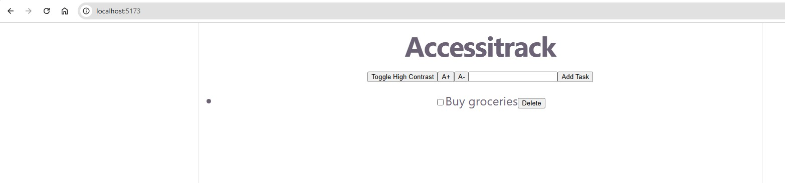
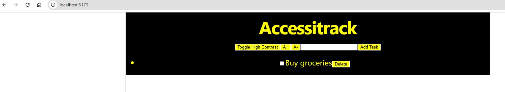

# Accessitrack

A task tracker built with accessibility as a first-class feature, not an afterthought — full keyboard navigation, screen-reader tested, high-contrast mode, and adjustable text sizing.

## Tech Stack

**Frontend:**
- React
- Vite
- Axios

**Backend:**
- Java
- Spring Boot
- PostgreSQL

## Features

- Toggle high contrast mode (black background, yellow text) for improved readability
- Increase or decrease text size for better accessibility
- Add and delete tasks
- Mark tasks as complete

## Accessibility Features

This project treats accessibility as a core feature, not an add-on. Every interactive element was tested for keyboard access and screen reader compatibility.

### High-Contrast Mode
Toggles the entire page to a black background with yellow text — a high-contrast color combination that improves readability for users with low vision. Verified with the axe DevTools automated scanner (0 issues) and manually inspected to ensure all text, including headings, remains visible after toggling (an early version had a heading contrast bug that was caught and fixed during testing).

### Adjustable Font Size
Users can increase or decrease text size across the entire app using the A+ / A- controls, supporting users with low vision who need larger text without relying on browser zoom.

### Keyboard Navigation
All interactive elements (buttons, checkboxes, and the task input field) are fully operable using only a keyboard — Tab to move between elements, Enter/Space to activate them. No mouse is required to use any feature of the app.

### Screen Reader Support
Every button and checkbox includes a descriptive `aria-label` so screen readers announce a clear description of each control's purpose and current state (e.g., "Enable high contrast mode" vs. "Disable high contrast mode," depending on the current toggle state). Manually tested using NVDA to confirm all labels are announced correctly.

### Automated Testing
Scanned with the axe DevTools browser extension, resulting in 0 accessibility issues (0 critical, 0 serious, 0 moderate, 0 minor).

## Setup Instructions

### Prerequisites
- Java 17
- Node.js
- PostgreSQL

### Backend
1. Navigate to the backend folder:
2. Create a PostgreSQL database named `accessitrack`
3. Update `src/main/resources/application.properties` with your database username and password
4. Run the server:

The backend will run on `http://localhost:8080`

### Frontend
1. Navigate to the frontend folder:
2. Install dependencies:
3. Run the dev server:

The app will run on `http://localhost:5173`

## Screenshots

### Normal Mode

### High-Contrast Mode

## Live Demo
   [https://accessitrack-frontend.vercel.app](https://accessitrack-frontend.vercel.app)